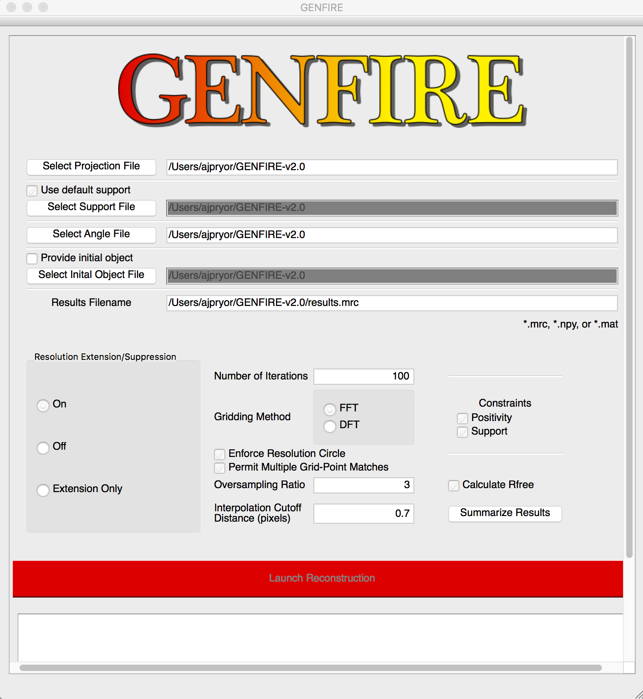

# Tutorial

This tutorial will walk you through your first GENFIRE 3D reconstruction. You will 
simulate a reconstruction of a tomographically-acquired tilt series using a vesicle model 
with GENFIRE's GUI.

First thing's first -- open the GUI. It looks like this

### Table of contents

- [Prerequisites](#tutorial)

## Prerequisites

- You need to have a GitHub account. If you don't have one, [sign up here](https://github.com/join) - it takes one minute. This is where your website will live - if you sign up with username `johnsmith` then your website will be `http://johnsmith.github.io